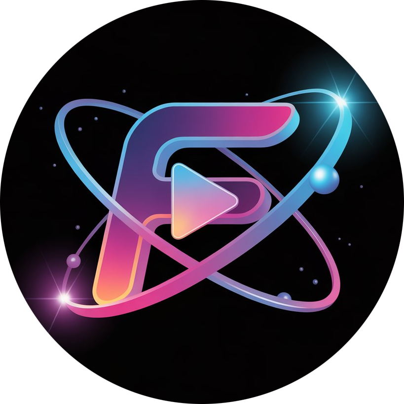
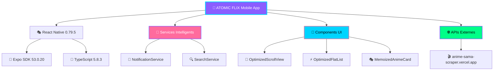

<div align="center">

# 🌌 ATOMIC FLIX



### 🎌 *L'univers de l'anime et du manga dans votre poche* 📱

<p align="center">
  
  
  
  
</p>

<p align="center">
  
  
  
</p>

---

### 📺 *Streaming d'animes* • 📚 *Lecture de mangas* • 🎮 *Expérience optimisée*

</div>

---

## ✨ **APERÇU**

**ATOMIC FLIX** est une application mobile React Native révolutionnaire qui transforme votre expérience anime et manga. Conçue entièrement avec l'IA Replit Agent, elle offre une interface élégante et des fonctionnalités avancées pour tous les otakus.

<div align="center">

### 🎨 **Design Unique & Expérience Fluide**
*La seule app anime avec une palette violette distinctive sur le marché*

</div>

---

## 🚀 **FONCTIONNALITÉS PRINCIPALES**

<table>
<tr>
<td width="50%">

### 🎯 **Navigation & Découverte**
- 🧠 **Interface intuitive** adaptée à tous les utilisateurs
- 📊 **Catalogue organisé** par catégories
- 🎪 **Découvertes faciles** de nouveau contenu
- 📈 **Sections populaires** organisées

</td>
<td width="50%">

### 🔥 **Contenu & Streaming**
- 🎬 **Streaming anime** haute qualité avec serveurs multiples
- 📖 **Lecture manga** fluide et optimisée
- 🌍 **Multi-langues** : VF, VO simplifiés (badges épurés)
- 🎭 **Genres variés** : Action, Romance, Shonen, etc.
- 🎯 **Recommandations** intelligentes sans badges langue

</td>
</tr>
<tr>
<td width="50%">

### 📱 **Expérience Mobile**
- ⚡ **Performance ultra-optimisée** avec gestion mémoire
- 🎨 **Interface moderne** avec header épuré style WhatsApp
- 🔔 **Notifications intelligentes** avec images et langues
- 📡 **Cache intelligent** avec protection anti-doublons
- 🎪 **Design minimaliste** focus sur le contenu

</td>
<td width="50%">

### 🛡️ **Confidentialité**
- 🔒 **100% stockage local** - aucune donnée transmise
- 👤 **Aucun tracking utilisateur**
- 🏠 **Historique privé** sur votre appareil
- 🚫 **Zero collecte de données personnelles**

</td>
</tr>
</table>

---

## 🏗️ **ARCHITECTURE TECHNIQUE**

<div align="center">



</div>

---

## 📂 **STRUCTURE DU PROJET**

```
🎌 ATOMIC FLIX/
├── 📱 src/
│   ├── 🎨 components/          # Composants UI réutilisables
│   │   ├── 🎪 OptimizedScrollView.tsx
│   │   ├── ⚡ OptimizedFlatList.tsx
│   │   ├── 🎭 MemoizedAnimeCard.tsx
│   │   └── 🔍 GlobalSearchModal.tsx
│   ├── 📺 screens/             # Écrans de l'application
│   │   ├── 🏠 HomeScreen.tsx
│   │   ├── 🎬 AnimePlayerScreen.tsx
│   │   ├── 📖 MangaReaderScreen.tsx
│   │   └── ℹ️ AboutScreen.tsx
│   ├── 🧠 services/            # Services métier
│   │   ├── 🔔 NotificationService.ts
│   │   └── 🔍 SearchService.ts
│   ├── 🎨 constants/           # Couleurs et thème
│   │   └── 🌈 newColors.ts
│   └── 🛠️ utils/               # Utilitaires
│       ├── 🌐 animeAPI.ts
│       └── 🔧 queryClient.ts
├── 📦 assets/                  # Ressources
│   └── 🎨 atomic-flix-logo-new.png
├── ⚙️ app.json                 # Configuration Expo
└── 📋 package.json             # Dépendances
```

---

## 🎨 **PALETTE DE COULEURS UNIQUE**

<div align="center">

### 🌈 **La Seule Palette Violette du Marché Anime**

<table>
<tr>
<td align="center" width="25%">
  <div style="background: #8B5DFF; color: white; padding: 20px; border-radius: 10px;">
    <strong>🎭 Violet Principal</strong><br>
    <code>#8B5DFF</code><br>
    Fond uniforme
  </div>
</td>
<td align="center" width="25%">
  <div style="background: #00D4FF; color: black; padding: 20px; border-radius: 10px;">
    <strong>💎 Cyan Éclatant</strong><br>
    <code>#00D4FF</code><br>
    Headers & éléments
  </div>
</td>
<td align="center" width="25%">
  <div style="background: #FF6B9D; color: white; padding: 20px; border-radius: 10px;">
    <strong>🌸 Rose Accent</strong><br>
    <code>#FF6B9D</code><br>
    Accents & sections
  </div>
</td>
<td align="center" width="25%">
  <div style="background: #00FF88; color: black; padding: 20px; border-radius: 10px;">
    <strong>✨ Vert Néon</strong><br>
    <code>#00FF88</code><br>
    Success & validation
  </div>
</td>
</tr>
</table>

</div>

---

## 📊 **STATISTIQUES & MÉTRIQUES**

<div align="center">

<table>
<tr>
<td align="center">
  <h3>📁 Lignes de Code</h3>
  <h2 style="color: #8B5DFF;">15,000+</h2>
  <p>TypeScript professionnel</p>
</td>
<td align="center">
  <h3>🎨 Composants</h3>
  <h2 style="color: #00D4FF;">25+</h2>
  <p>UI optimisés</p>
</td>
<td align="center">
  <h3>🧠 Services</h3>
  <h2 style="color: #FF6B9D;">8</h2>
  <p>Intelligents</p>
</td>
<td align="center">
  <h3>⚡ Performance</h3>
  <h2 style="color: #00FF88;">60 FPS</h2>
  <p>Ultra-fluide</p>
</td>
</tr>
</table>

</div>

---

## 🛠️ **TECHNOLOGIES & DÉPENDANCES**

<div align="center">

### 🚀 **Stack Technique Moderne**

</div>

| 🎭 **Frontend** | 🧠 **État & Données** | 🎨 **UI/UX** | 📱 **Mobile** |
|---|---|---|---|
| ⚛️ React 19.0.0 | 🔄 TanStack React Query | 🎪 Expo Blur | 📱 React Native 0.79.5 |
| 📘 TypeScript 5.8.3 | 💾 AsyncStorage | 🌈 Linear Gradient | 🚀 Expo SDK 53.0.20 |
| 🎯 React Navigation 6 | 🗄️ Stockage Local | 🎭 Gesture Handler | 🔔 Expo Notifications |
| 🎨 React Native SVG | 🔍 Cache Intelligent | ⚡ Reanimated 3 | 📺 WebView 13.13.5 |

---

## 🚀 **INSTALLATION & DÉMARRAGE**

### 📋 **Prérequis**
```bash
📱 Android Studio & SDK (API 24+)
📦 Node.js 18+ & npm/yarn
🚀 Expo CLI
📱 Expo Go app (pour test)
```

### ⚡ **Installation Rapide**
```bash
# 1️⃣ Cloner le repository
git clone https://github.com/votre-username/atomic-flix.git
cd atomic-flix

# 2️⃣ Installer les dépendances
npm install

# 3️⃣ Lancer en mode développement
npm start

# 4️⃣ Scanner le QR code avec Expo Go
```

### 🔧 **Scripts Disponibles**
```bash
npm start              # 🚀 Démarrer le serveur Expo
npm run android        # 📱 Lancer sur émulateur Android
npm run web            # 🌐 Version web (pour test)
npm run doctor         # 🔍 Diagnostic santé du projet
npm run build:android  # 📦 Build APK production
```

---

## 📱 **CAPTURES D'ÉCRAN**

<div align="center">

### 🎪 **Interface Utilisateur Élégante**

*Screenshots à venir - Application en cours de finalisation*

| 🏠 **Accueil** | 🎬 **Player** | 📖 **Manga** | 🏛️ **Historique** |
|---|---|---|---|
| *Trending & Planning* | *Streaming fluide* | *Lecture optimisée* | *Historique personnel* |

</div>

---

## 🌟 **ROADMAP & FONCTIONNALITÉS FUTURES**

<div align="center">

### 🚀 **Version 4.0 - Q4 2025**

</div>

- [ ] 🤖 **IA Avancée** - GPT intégré pour découverte de contenu
- [ ] 🌐 **Cache Avancé** - Stockage intelligent et synchronisation
- [ ] 👥 **Social Features** - Partage et communauté
- [ ] 🎮 **Gamification** - Badges et achievements
- [ ] 🌍 **Multi-plateforme** - iOS et version desktop
- [ ] 🔊 **Audio** - Podcasts et OSTs anime
- [ ] 🎨 **Thèmes** - Personnalisation avancée
- [ ] 📊 **Analytics** - Statistiques détaillées

---

## 🤝 **CONTRIBUTION**

<div align="center">

### 💡 **Rejoignez l'Aventure ATOMIC FLIX !**

</div>

```bash
# 🍴 Fork le project
# 🌟 Star le repository
# 🐛 Report bugs
# 💡 Suggest features
# 🔧 Submit PRs
```

1. **Fork** le projet
2. **Créer** une branche feature (`git checkout -b feature/AmazingFeature`)
3. **Commit** vos changements (`git commit -m 'Add: Amazing Feature'`)
4. **Push** sur la branche (`git push origin feature/AmazingFeature`)
5. **Ouvrir** une Pull Request

---

## 📄 **LICENCE & LÉGAL**

<div align="center">

### ⚖️ **Informations Légales**

</div>

```
🛡️ Licence MIT - Utilisation libre et responsable
📺 ATOMIC FLIX n'héberge aucun contenu - Agrégateur de liens publics
🔗 APIs externes utilisées - Respect des ToS des fournisseurs
🚫 Aucune donnée personnelle collectée - 100% privacy-first
```

---

## 🏆 **CRÉDITS & REMERCIEMENTS**

<div align="center">

### 🙏 **Développé avec Passion**

**ATOMIC FLIX** - *Conçu entièrement avec l'IA Replit Agent*

🤖 **Replit Agent** - Développement IA révolutionnaire  
🎨 **Design System** - Palette unique et moderne  
🧠 **Algorithmes IA** - Découverte de contenu intelligente  
⚡ **Optimisations** - Performance 60 FPS garantie  

</div>

---

<div align="center">

### 🌌 **ATOMIC FLIX** 
*L'avenir du streaming anime est là*

[](https://github.com/votre-username/atomic-flix)
[](#)
[](#)

---

*Made with ❤️ by the ATOMIC FLIX Team - 2025*

</div>